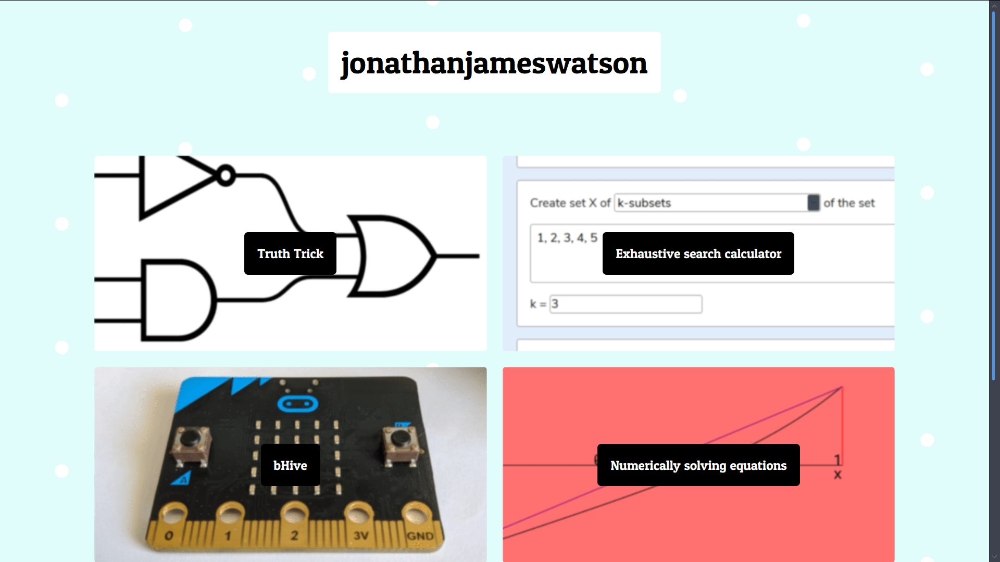

# jonathanjameswatson.github.io

> A website for my projects



## Development

``` bash
# install dependencies
$ yarn install

# serve with hot reload at localhost:3000
$ yarn run dev

# generate static project
$ yarn run generate
```

## Built With

* [NuxtJS](https://github.com/nuxt/nuxt.js) - Web framework
* [Bulma](https://github.com/jgthms/bulma) - CSS framework
* [Sass](https://github.com/sass/sass) - CSS preprocessor
* [glslCanvas](https://github.com/patriciogonzalezvivo/glslCanvas) - Used to load GLSL background
